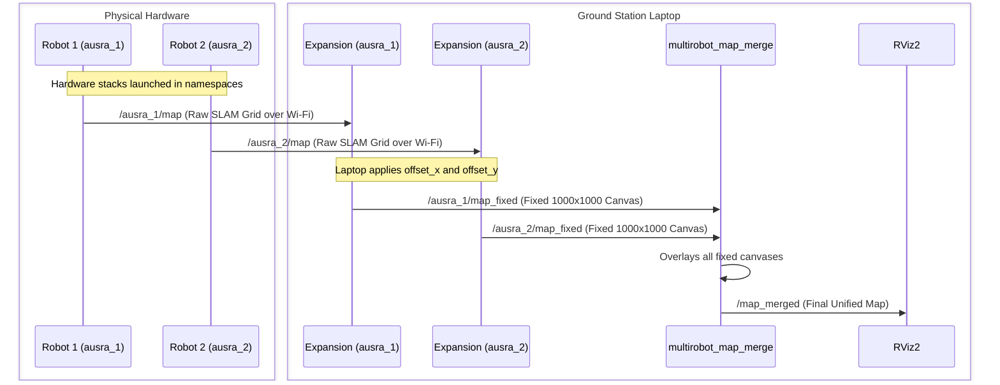

# Centralized Multi-Robot Map Merge Architecture

## 1. System Overview

The `ausra_map_merge_HW` package is currently configured to run as a **Centralized System**. This means that instead of every robot calculating the map merge itself, a single "Brain" (usually a ground station laptop) collects all the data over the Wi-Fi network, processes it, and generates the final merged map.

## 2. Network Topology

Here is how the system is distributed across your hardware:

### The Data Sources (The Physical Robots)
Each physical robot is responsible for its own sensors, hardware drivers, and running `slam_toolbox`. 
By launching their hardware stacks inside a specific namespace (e.g., `/ausra_1` and `/ausra_2`), they isolate their topics. They broadcast their raw, shifting maps over the Wi-Fi network.

### The Brain (The Ground Station Laptop)
The laptop runs the `map_merge_hw.launch.py` script. It acts as the central hub:
1. It listens to the Wi-Fi network for `/ausra_1/map` and `/ausra_2/map`.
2. It spins up a dedicated `map_expansion_node` for each robot it discovers in the `ROBOT_HW_CONFIG`.
3. It applies the tape-measured physical offsets (`robot_offset_x` and `robot_offset_y`).
4. It feeds these fixed canvases into the single, central `multirobot_map_merge` node.
5. It publishes the final `/map_merged` topic for you to view in RViz.

---

## 3. Data Flow Diagram



---

## 4. How to Launch the System

To bring up the entire multi-robot network, execute the following commands on the respective machines:

**On Robot 1's Computer:**
```bash
ros2 launch lidar_slam_pkg hardware_full_stack.launch.py --ros-args -r __ns:=/ausra_1
```

**On Robot 2's Computer:**
```bash
ros2 launch lidar_slam_pkg hardware_full_stack.launch.py --ros-args -r __ns:=/ausra_2
```

**On the Ground Station Laptop:**
Ensure the `ROBOT_HW_CONFIG` in `map_merge_hw.launch.py` has the correct tape-measured offsets, then run:
```bash
ros2 launch ausra_map_merge_HW map_merge_hw.launch.py
```

---

## 5. Architectural Trade-Offs

Because you are using a centralized approach, it is important to understand the trade-offs:

### Benefits ✅
* **Compute Efficiency:** The robots do not waste CPU cycles computing the map merge; all heavy lifting is offloaded to the powerful ground station laptop.
* **Simplicity:** There is only one merged map published on the entire network (`/map_merged`), making it very easy to visualize in RViz.
* **No Phantom Nodes:** Because the central merger sees both Robot 1 and Robot 2 immediately, the segfault bug is natively bypassed without needing fake data.

### Drawbacks ⚠️
* **Network Bandwidth:** The map merger requires dense `OccupancyGrid` messages to operate. Sending these large arrays over Wi-Fi at 1 Hz for 2 robots is perfectly fine, but scaling to 5+ robots may saturate standard Wi-Fi routers.
* **Single Point of Failure:** If the ground station laptop goes to sleep or disconnects from the Wi-Fi, the map merging process stops completely for the entire swarm.
