# 🔍 Senior Architecture Review — AUSRA Multi-Robot Map Merge Pipeline

> **Scope:** Full validation of namespace rigidity, `init_pose` zeroing, `OpaqueFunction` CLI parsing, and end-to-end data flow from `hardware_full_stack.launch.py` through `map_expansion_node` to `multirobot_map_merge`.

---

## 1. Is the Namespace Approach Fully Rigid and Robust?

**Verdict: ✅ YES — with one important caveat.**

### What works correctly

The data flow is fully namespace-agnostic across all three stages:

| Stage | Component | How namespace flows |
|-------|-----------|-------------------|
| **Robot launch** | `hardware_full_stack.launch.py` | `robot_name:=<anything>` → `PushRosNamespace` wraps all nodes → SLAM publishes to `/<anything>/map` |
| **Expansion** | `map_expansion_node` | Subscribes to `/<anything>/map` (injected via `input_topic` param) → publishes to `/<anything>/map_fixed` |
| **Merger** | `multirobot_map_merge` | `robot_namespace: ""` means it scans **all** topics in the ROS graph matching `*/map_fixed` → discovers any namespace |

The `robot_config` CLI argument (`"alpha:1.0:0.0 beta:3.45:0.15"`) correctly propagates the namespace string into:
- The expansion node's `input_topic` and `output_topic` parameters
- The `dynamic_init_poses` dictionary keys (`/alpha/map_merge/init_pose_x`, etc.)

> [!IMPORTANT]
> **The caveat with `robot_namespace: ""`:** When set to empty, `multirobot_map_merge` will discover **any** topic ending in `/map_fixed` on the entire ROS graph — not just your robots. If another unrelated node happens to publish a topic like `/debug/map_fixed`, the merger would attempt to include it. In practice this is extremely unlikely in your hardware deployment, but be aware of it. If you ever need to restrict discovery, you can set `robot_namespace` to a common prefix shared by all your robots (e.g. `"ausra_"` or `"swarm_"`).

---

## 2. Edge Cases — Can the OpaqueFunction CLI Parsing Fail?

**Verdict: ✅ Structurally sound. A few minor edge cases exist but are non-fatal.**

### Validated as safe

| Scenario | Behavior |
|----------|----------|
| Normal input `"alpha:1.0:0.0 beta:3.45:0.15"` | ✅ Parses correctly |
| Default value (no `robot_config` passed) | ✅ Falls back to `"ausra_1:1.0:0.0 ausra_2:1.0:0.15"` |
| Malformed entry `"alpha:1.0"` (missing Y) | ✅ Caught by `try-except ValueError`, logs error, skips entry |
| Extra whitespace `"alpha:1.0:0.0  beta:3.45:0.15"` | ✅ `split()` handles multiple spaces correctly |
| Empty string `""` | ✅ `strip()` check prevents crash — launches merger with 0 robots |

### Minor edge cases to be aware of

| Scenario | Behavior | Risk |
|----------|----------|------|
| Name contains colons `"robot:v2:1.0:0.0"` | ❌ `split(':')` yields 4 parts, `ValueError` on unpacking | **Low** — unlikely robot name |
| Negative offsets `"alpha:-1.0:0.0"` | ✅ `float("-1.0")` parses correctly | None |
| Very large offset beyond canvas bounds | ✅ `map_expansion_node` logs `CANVAS OVERFLOW` warning, drops out-of-bounds cells | Data loss, not crash |
| Duplicate robot name `"alpha:1.0:0.0 alpha:2.0:0.0"` | ⚠️ Second entry silently overwrites first in dict | **Low** — operator error |

> [!NOTE]
> None of these edge cases will cause a crash or segfault. The worst outcome is a robot being silently excluded from the merge, which is observable in the startup logs.

---

## 3. Are the `init_pose` Zero Overrides Structurally Correct?

**Verdict: ✅ YES — this is the only correct approach for your architecture.**

### Proof of correctness

The data flow has two stages of spatial transformation:

```
Stage 1 (map_expansion_node):
  canvas_col = round((local_slam_origin_x + robot_offset_x - canvas_origin_x) / resolution) + col
             = (world_x_of_cell - canvas_origin_x) / resolution
  → The physical offset is ALREADY baked into the pixel positions.

Stage 2 (multirobot_map_merge):
  If init_pose_x = 0.0 → merger applies NO additional shift → ✅ correct alignment
  If init_pose_x = robot_offset_x → merger shifts AGAIN → ❌ double-shift error
```

### Implementation validation

The dynamic injection in [map_merge_hw.launch.py](file:///home/ahmedmahmoud/Swarm-HW/src/AUSRA-Autonomous-System/ausra_map_merge_HW/launch/map_merge_hw.launch.py#L116-L123):

```python
dynamic_init_poses = {}
for robot_name in robot_hw_config.keys():
    dynamic_init_poses[f'/{robot_name}/map_merge/init_pose_x'] = 0.0
    dynamic_init_poses[f'/{robot_name}/map_merge/init_pose_y'] = 0.0
    dynamic_init_poses[f'/{robot_name}/map_merge/init_pose_z'] = 0.0
    dynamic_init_poses[f'/{robot_name}/map_merge/init_pose_yaw'] = 0.0
```

This is passed as a second parameter dict to the `Node`:
```python
parameters=[params_file, dynamic_init_poses],
```

In ROS 2, when you pass multiple parameter sources, later entries **override** earlier ones. Since the YAML file no longer contains any `init_pose` entries, and the dynamic dict sets them all to `0.0`, there is **zero risk** of stale or conflicting values.

> [!CAUTION]
> The `known_init_poses: true` setting in [map_merge_HW_params.yaml](file:///home/ahmedmahmoud/Swarm-HW/src/AUSRA-Autonomous-System/ausra_map_merge_HW/config/map_merge_HW_params.yaml#L28) is **critical**. If this were set to `false`, the merger would ignore your `init_pose_*` values entirely and attempt feature-based alignment (which would fail on pre-shifted canvases). It is currently set correctly to `true`. **Do not change it.**

---

## 4. Confidence — Will Everything Work Together?

**Verdict: ✅ YES — high confidence. The pipeline is correctly wired end-to-end.**

### Full data flow trace for a concrete example

```
Terminal command:
  Robot 1: ros2 launch lidar_slam_pkg hardware_full_stack.launch.py robot_name:=alpha
  Robot 2: ros2 launch lidar_slam_pkg hardware_full_stack.launch.py robot_name:=beta
  Merger:  ros2 launch ausra_map_merge_HW map_merge_hw.launch.py robot_config:="alpha:1.0:0.0 beta:3.45:0.15"
```



```mermaid
flowchart TD
    subgraph Robot_Alpha["Robot 'alpha' (hardware_full_stack)"]
        A1[SLAM Toolbox] -->|"/alpha/map"| A2[map_expansion_alpha]
    end
    subgraph Robot_Beta["Robot 'beta' (hardware_full_stack)"]
        B1[SLAM Toolbox] -->|"/beta/map"| B2[map_expansion_beta]
    end
    subgraph Merger["Map Merge (map_merge_hw.launch.py)"]
        A2 -->|"/alpha/map_fixed"| M[multirobot_map_merge]
        B2 -->|"/beta/map_fixed"| M
        M -->|"/map_merged"| OUT[RViz / Downstream]
    end
    
    style Robot_Alpha fill:#1a3a2a,stroke:#4ade80
    style Robot_Beta fill:#1a2a3a,stroke:#60a5fa
    style Merger fill:#2a1a3a,stroke:#c084fc
```

### Checklist

| Check | Status |
|-------|--------|
| `hardware_full_stack` wraps SLAM in correct namespace via `PushRosNamespace` | ✅ |
| SLAM publishes to `/<robot_name>/map` (relative `'map'` topic inside namespace) | ✅ |
| `map_expansion_node` subscribes to `/<robot_name>/map` via absolute `input_topic` param | ✅ |
| `map_expansion_node` publishes to `/<robot_name>/map_fixed` via absolute `output_topic` param | ✅ |
| `robot_namespace: ""` allows merger to discover any `*/map_fixed` topic | ✅ |
| `robot_map_topic: map_fixed` matches expansion node output suffix | ✅ |
| `init_pose_*` dynamically set to `0.0` for all parsed robot names | ✅ |
| `known_init_poses: true` ensures merger uses the zero poses, not feature matching | ✅ |
| Parameter override order (`[params_file, dynamic_init_poses]`) is correct (later overrides earlier) | ✅ |
| `OpaqueFunction` ensures CLI args are resolved before node creation | ✅ |
| Error handling for malformed `robot_config` entries exists | ✅ |

---

## 5. Suggestions for Improvement

> [!TIP]
> The following suggestions are optional improvements that could make the system cleaner or more future-proof. None are required for the current architecture to function correctly.

### 5.1 — Stale Documentation in YAML Comments

The YAML file still references `ROBOT_HW_CONFIG` (line 10) which no longer exists. Update the comment block:

```diff
-#   WHERE spawn coordinates live → map_merge_hw.launch.py (ROBOT_HW_CONFIG)
-#   WHERE init_pose_* lives      → here, always 0.0
+#   WHERE spawn coordinates live → CLI argument robot_config (parsed at launch)
+#   WHERE init_pose_* lives      → dynamically injected as 0.0 at launch time
```

### 5.2 — Input Validation: Minimum Robot Count

If someone launches with `robot_config:=""` (empty), the merger will start with zero robots and sit idle forever. Add a guard:

```python
if robot_count < 2:
    actions.append(LogInfo(msg=(
        '[WARNING] Less than 2 robots configured. '
        'multirobot_map_merge requires at least 2 robots to merge.'
    )))
```

### 5.3 — Stale Documentation in `map_expansion_node.cpp`

Line 13 of [map_expansion_node.cpp](file:///home/ahmedmahmoud/Swarm-HW/src/AUSRA-Autonomous-System/ausra_map_merge_HW/src/map_expansion_node.cpp#L13) still says:
```
//   - Default output_topic is "/ausra_1/map_fixed".
```
This should be updated to reflect the dynamic nature:
```
//   - output_topic is injected at launch time (e.g. "/alpha/map_fixed").
```

### 5.4 — Log the Parsed Config for Debugging

Add a summary log after parsing so operators can instantly verify correctness at launch:

```python
for robot_name, cfg in robot_hw_config.items():
    actions.append(LogInfo(msg=(
        f'[PARSED] {robot_name} → expansion: /{robot_name}/map → /{robot_name}/map_fixed '
        f'| init_pose: all 0.0 | offset: ({cfg["offset_x"]}, {cfg["offset_y"]})'
    )))
```

### 5.5 — Update the Multi Robot Upgrade Guide

The doc at [Multi_Robot_Hardware_Upgrade_Guide.md](file:///home/ahmedmahmoud/Swarm-HW/src/AUSRA-Autonomous-System/ausra_map_merge_HW/docs/Multi_robot/Multi_Robot_Hardware_Upgrade_Guide.md) (line 167, 373) still references `robot_namespace: ausra_`. This should be updated to reflect the new `robot_namespace: ""` and CLI-based workflow.

---

## Final Verdict

> **The architecture is production-ready.** The namespace flow is fully rigid from robot launch through map expansion to the merger. The `init_pose` zeroing is mathematically correct given the pre-shifting done by `map_expansion_node`. The `OpaqueFunction` CLI parsing is robust with proper error handling. No structural changes are required.
