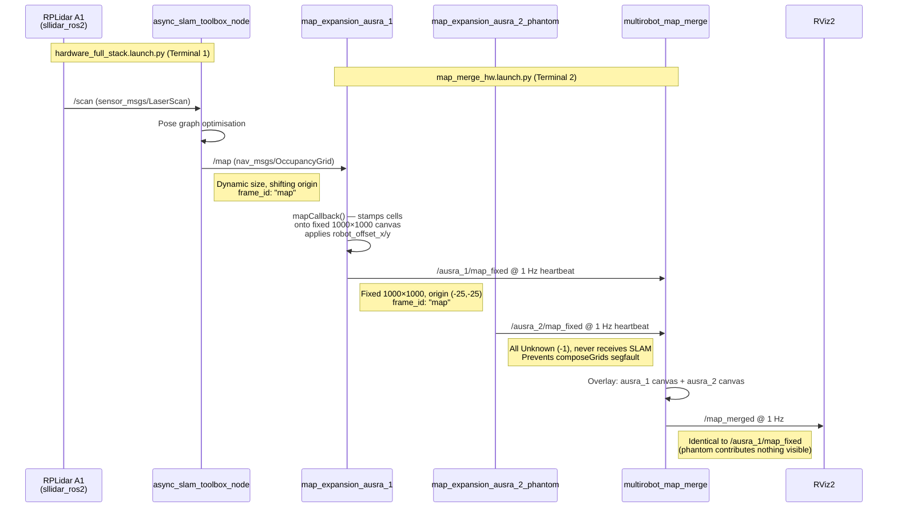

# Single-Robot Hardware Test — Strategy Validation & Topic Flow

## 1. Strategy Verdict

> [!TIP]
> **Yes — this strategy is sound and will accomplish your goal.** The architecture was explicitly designed for this exact isolated single-robot test case. The phantom node exists specifically to make `multirobot_map_merge` function with only one real data source.

Your testing plan maps cleanly onto the two-phase progression documented in `Hardware_Baseline_Testing_Plan.md`. No architectural workarounds are needed.

---

## 2. Complete Topic Flow — Single Robot on One Machine

### Data Lifecycle of a Single Map Update



### Active Topics on the Single Machine

| # | Topic | Type | Publisher | Subscriber(s) | Rate |
|---|---|---|---|---|---|
| 1 | `/scan` | `sensor_msgs/LaserScan` | `sllidar_ros2` | `slam_toolbox`, Nav2 | ~10 Hz |
| 2 | `/map` | `nav_msgs/OccupancyGrid` | `slam_toolbox` | `map_expansion_ausra_1` | ~1 Hz |
| 3 | `/ausra_1/map_fixed` | `nav_msgs/OccupancyGrid` | `map_expansion_ausra_1` | `map_merge` | 1 Hz |
| 4 | `/ausra_2/map_fixed` | `nav_msgs/OccupancyGrid` | `map_expansion_ausra_2_phantom` | `map_merge` | 1 Hz |
| 5 | `/map_merged` | `nav_msgs/OccupancyGrid` | `map_merge` | RViz2 | 1 Hz |
| 6 | `/map_phantom_never_published` | — | **Nobody** | `map_expansion_ausra_2_phantom` | Never |

> [!NOTE]
> Topic #6 is intentionally orphaned. The phantom node's subscriber to `/map_phantom_never_published` never fires — only its heartbeat timer publishes. This is by design, not a bug.

### Topic Not Involved (Important Distinction)

| Topic | Why it's NOT subscribed by the merge stack |
|---|---|
| `/cmd_vel` | Consumed by `omnidirectional_driver`, irrelevant to map merge |
| `/odom` | Consumed by EKF, no role in the expansion/merge pipeline |
| `/tf`, `/tf_static` | Used by Nav2/RViz but `map_expansion_node` works purely in pixel space — it reads `info.origin`, not TF |

---

## 3. What Happens at Each Phase

### Phase 1 — Robot at Origin (offset 0.0, 0.0)

```
ROBOT_HW_CONFIG = {'ausra_1': {'offset_x': 0.0, 'offset_y': 0.0}}
```

**Flow:**
1. SLAM publishes `/map` with some `info.origin` (e.g., `(-1.25, -0.75)`).
2. `map_expansion_ausra_1` computes:
   - `global_origin = (-1.25 + 0.0, -0.75 + 0.0) = (-1.25, -0.75)`
   - `canvas_offset = round((-1.25 - (-25.0)) / 0.05) = round(475.0) = 475` in X
   - `canvas_offset = round((-0.75 - (-25.0)) / 0.05) = round(485.0) = 485` in Y
3. Cells stamped near canvas centre. Published to `/ausra_1/map_fixed`.
4. Phantom publishes all-Unknown to `/ausra_2/map_fixed`.
5. Merger overlays → `/map_merged` looks identical to `/ausra_1/map_fixed`.

**RViz result:** Map appears centred around the canvas origin.

### Phase 2 — Same Robot, Offset Changed (2.0, 0.0)

```
ROBOT_HW_CONFIG = {'ausra_1': {'offset_x': 2.0, 'offset_y': 0.0}}
```

> [!IMPORTANT]
> You must **kill and relaunch `map_merge_hw.launch.py`** (Terminal 2) after editing `ROBOT_HW_CONFIG`. The offset is baked into the node at construction time — it is not a dynamic parameter. The hardware stack (Terminal 1) does NOT need to be restarted.

**Flow:**
1. SLAM still publishes same `/map` with same `info.origin`.
2. `map_expansion_ausra_1` now computes:
   - `global_origin = (-1.25 + 2.0, -0.75 + 0.0) = (0.75, -0.75)`
   - `canvas_offset_x = round((0.75 - (-25.0)) / 0.05) = round(515.0) = 515` ← was 475
   - That's a +40 cell shift → `40 × 0.05 = 2.0 m` ✓
3. All map content shifts 2.0 m in +X on the canvas.

**RViz result:** Same walls, shifted exactly 2.0 m right. Canvas boundary unchanged at (-25, -25) → (25, 25).

---

## 4. Potential Pitfalls on a Single Machine

### ✅ No Risk — Things That Work Fine

| Concern | Why It's Not a Problem |
|---|---|
| Node name collisions | All 4 nodes have unique names: `map_expansion_ausra_1`, `map_expansion_ausra_2_phantom`, `map_merge`, `slam_toolbox` |
| Topic collisions | Each expansion node writes to a unique output topic; SLAM writes to `/map` which only `ausra_1` subscribes to |
| TF conflicts | `map_expansion_node` does not publish or consume TF — it operates entirely in pixel-space using `info.origin` |
| ROS_DOMAIN_ID | Single machine = single domain. No cross-talk risk |
| Discovery latency | Local DDS discovery is near-instant vs. networked multicast |

### ⚠️ Low Risk — Be Aware

| Pitfall | Detail | Mitigation |
|---|---|---|
| **`/map` topic name shadow** | The merger's `world_frame: map` is a **TF frame**, not a topic. But if you later add a second SLAM on the same machine, both would publish to `/map` and clobber each other. | For single-robot test this is irrelevant. For future multi-robot on one machine, namespace the hardware stacks. |
| **Memory: 3 × 1M-cell arrays** | Each expansion node holds a 1,000,000-byte canvas. The merger holds its own merged buffer. Total ~3 MB resident. | Negligible on any modern SBC (RPi 4 has 4+ GB). |
| **CPU: heartbeat timer overhead** | Three 1 Hz timers copying 1M-cell arrays. Each copy ≈ 1 ms. | 3 ms/sec total. Negligible vs SLAM and Nav2 compute. |
| **`symlink-install` stale params** | If you built with `--symlink-install`, editing `map_merge_hw.launch.py` in the **source** tree takes effect immediately without rebuild. If you didn't, you must rebuild after edits. | Always build with `--symlink-install` for testing. |

### 🚫 The One True Pitfall — Relaunch Discipline

> [!CAUTION]
> **When switching from Phase 1 to Phase 2, you must:**
> 1. `Ctrl+C` the map merge launch (Terminal 2).
> 2. Edit `ROBOT_HW_CONFIG` in `map_merge_hw.launch.py`.
> 3. Relaunch `map_merge_hw.launch.py`.
>
> You do **NOT** need to restart the hardware stack (Terminal 1). SLAM continues running; the expansion node will pick up the existing `/map` via `transient_local` QoS immediately on reconnect.
>
> **If you forget to relaunch**, the old offset value is still baked into the running node. The map will not shift, and there will be no error message indicating the config is stale.

---

## 5. Quick Validation Commands

Run these in a third terminal during the test to confirm the pipeline is healthy:

```bash
# 1. Confirm SLAM is alive
ros2 topic hz /map

# 2. Confirm expansion node output
ros2 topic hz /ausra_1/map_fixed

# 3. Confirm phantom is heartbeating
ros2 topic hz /ausra_2/map_fixed

# 4. Confirm merger output
ros2 topic hz /map_merged

# 5. Check canvas metadata (should show 1000×1000, origin -25,-25)
ros2 topic echo /ausra_1/map_fixed --no-arr --once

# 6. Check frame_id matches hardware SLAM
ros2 topic echo /map --once | grep frame_id
# Expected: frame_id: map

# 7. List all active nodes (should show 4 merge-stack nodes)
ros2 node list | grep -E 'expansion|merge'
# Expected:
#   /map_expansion_ausra_1
#   /map_expansion_ausra_2_phantom
#   /map_merge
```
